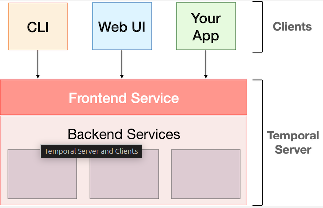
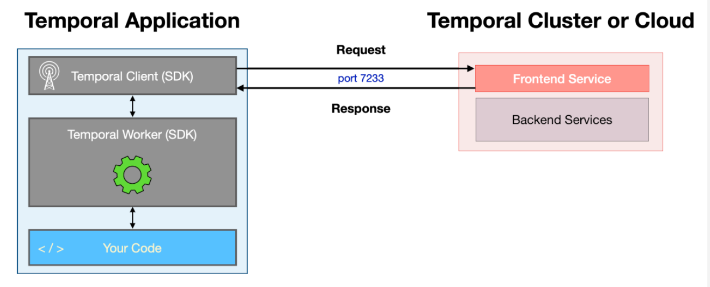
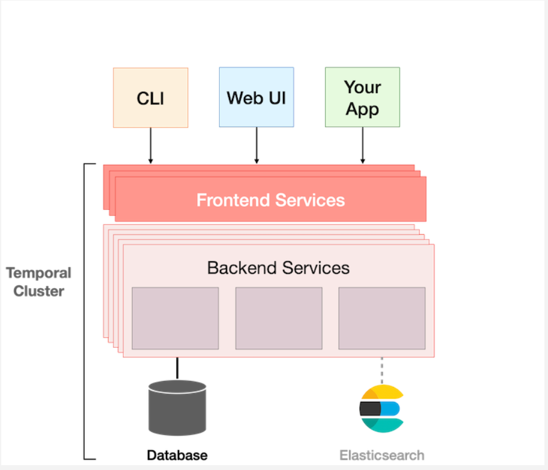
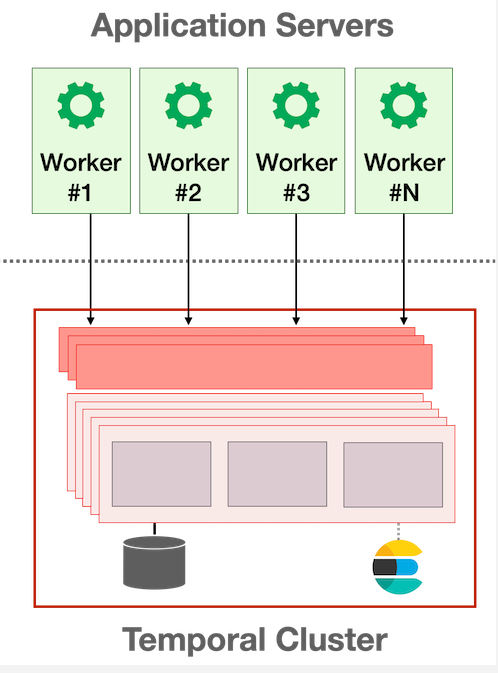

# Temporal
Temporal is a platform that guarantees the durable execution of your application code.

Temporal applications are built using an abstraction called workflows.

Temporal workflows are resilient (elastic).

## What is a workflow?
A workflow is a sequence of steps.

In Temporal, these steps are defined by writing code.

## Temporal Server

Temporal platform having two parts

The Frontend service is part of Temporal server acts as an API gateway.(a frontend for client not for end users `end users will interact with the CLI or Web UI`)

>> Clients communicate with the Temporal Server by issuing requests to this Frontend Service. The Frontend Service then communicates with backend services, as necessary to fulfill the request, and then returns a response to the client. Communication to and within the Cluster is done using gRPC, a popular high-performance open source RPC framework originally developed at Google and now part of the Cloud Native Computing Foundation ecosystem. The messages themselves are encoded using Protocol Buffers, an open source serialization mechanism also originally developed at Google.

## Temporal Cluster

## Workers

>> The entity responsible for executing your code is known as a Worker, and it's common to run Workers on multiple servers, since this increases both the scalability and availability of your application. The Worker, which is part of your application, communicates with the Temporal Cluster to manage the execution of your Workflows.

## Writing a Workflow Definition
In Temporal, you define a Workflow in Go by creating a function. The code that makes up that function is known as the Workflow Definition.

Turning this function into a Temporal Workflow Definition requires just three steps.

    1.Import the workflow package from the SDK
    2.Add workflow.Context as the first input parameter
    3.Update the return value to include an error type (its value can be nil)

## Initializing the Worker
There are typically three things you need in order to configure a Worker:

    1.A Temporal Client, which used to communicate with the Temporal Cluster. 
    2.The name of a Task Queue, which is maintained by the Temporal Server and polled by the Worker. 
    3.The fully-qualified name of the Workflow Definition function, which is used in the call to RegisterWorkflow. Every Workflow Definition function must be registered with at least one Worker for execution to proceed, but you may register multiple of these functions with any given Worker.

### commadn to run a workflow

`temporal workflow start --type GreetingSomeone --task-queue greeing-tasks --workflow-id my-first-workflow --input '"Abdul"'`

When you run the command, it submits your execution request to the cluster, which responds with the Workflow ID, which will be the same as the one you provided, or assigned UUID if you omitted it.

It also displays a Run ID, which uniquely identifies this specific execution of the Workflow. However, it does not display the result returned by the Workflow, since Workflows might run for months or years. You can use the temporal workflow show command to display the result.

`temporal workflow show --workflow-id my-first-workflow`